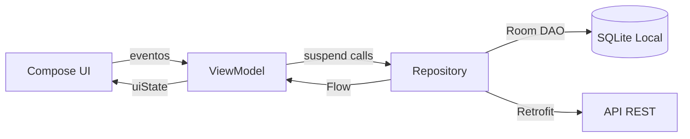
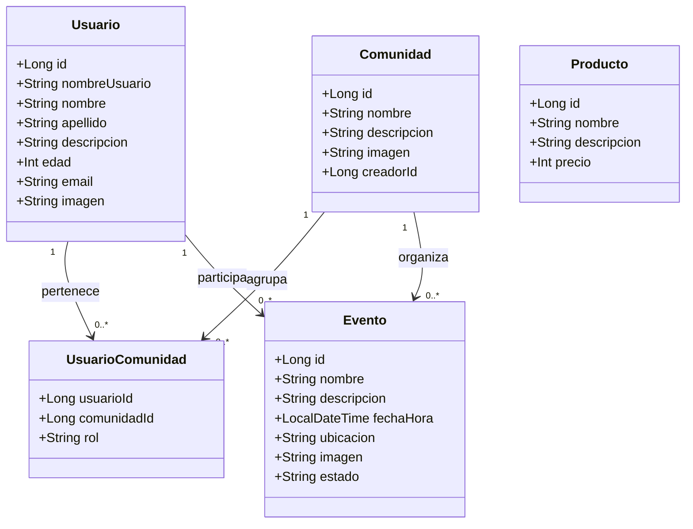

# EcoQuest — Pequeñas acciones, gran impacto

**Documentación del Proyecto Integrado — 2º DAM**  
**IES Doctor Balmis · Curso 2025–2026**  
**Equipo:** Prompt  

| Nombre | Rol |
|--------|-----|
| Iván Arias Pastor | Developer / Maker |
| Abdurrahman Belaziz Amier | Developer / Divergent |
| Michel Garcia Galipienso | Developer / Divergent |
| Saúl Valcarcel Picapiedra | Analyst |

---

## Índice

1. [Introducción](#1-introducción)
2. [Requisitos Funcionales](#2-requisitos-funcionales-de-la-aplicación)
3. [Análisis y Diseño](#3-análisis-y-diseño)
4. [Codificación](#4-codificación)
5. [Manual de Usuario](#5-manual-de-usuario)
6. [Requisitos e Instalación](#6-requisitos-e-instalación)
7. [Conclusiones](#7-conclusiones)
8. [Bibliografía](#8-bibliografía)

---

## 1. Introducción

### 1.1 Objetivo

EcoQuest es una plataforma móvil y de escritorio diseñada para fomentar la educación ambiental y la acción ecológica colectiva. Su objetivo principal es transformar los hábitos sostenibles en una experiencia gamificada, accesible y comunitaria, facilitando que cualquier persona pueda contribuir a los Objetivos de Desarrollo Sostenible (ODS) de la ONU desde su teléfono móvil.

Los objetivos concretos del sistema son:

- Proporcionar a los usuarios retos ecológicos diarios y verificables.
- Crear un sistema de comunidades locales donde los participantes colaboren y compitan de forma positiva.
- Ofrecer a organizaciones (ONG, centros educativos, administraciones) una herramienta de gestión para crear y moderar contenido.
- Registrar y visualizar el impacto colectivo de las acciones realizadas.

### 1.2 Justificación

El proyecto surge de la observación de que existe una brecha entre la conciencia medioambiental de los jóvenes y su acción real. Las aplicaciones actuales de seguimiento de hábitos ecológicos son, en su mayoría, individualistas y carentes de un componente social que motive la participación continua. EcoQuest justifica su existencia en tres pilares:

**Necesidad social:** La crisis climática requiere cambios de comportamiento a escala masiva. Una aplicación que haga visible el impacto colectivo puede servir de catalizador.

**Alineación con los ODS:** El proyecto está directamente alineado con los ODS 4 (Educación de Calidad), 6 (Agua limpia y Saneamiento), 12 (Producción y Consumo Responsables) y 13 (Acción por el Clima).

**Viabilidad técnica:** El stack tecnológico elegido (Android nativo, Spring Boot, PostgreSQL) es maduro, de código abierto y ampliamente utilizado en la industria, lo que garantiza escalabilidad y mantenibilidad.

### 1.3 Análisis de lo Existente

Existen varias aplicaciones con propósitos similares que sirven de referencia:

| Aplicación | Descripción | Diferencia con EcoQuest |
|---|---|---|
| **Olio** | Red de intercambio de objetos y alimentos | Sin gamificación ni retos ecológicos |
| **JouleBug** | Retos de sostenibilidad individual | Sin componente de comunidad local |
| **Ecosia** | Motor de búsqueda que planta árboles | Sin interacción social directa |
| **Too Good To Go** | Reducción del desperdicio alimentario | Enfoque exclusivo en comida |
| **Forest** | Productividad ligada a plantar árboles virtuales | Sin impacto real ni colectivo |

EcoQuest se diferencia al combinar en una sola plataforma: gamificación, comunidades locales gestionables, sistema de puntos canjeables y herramientas de administración para organizaciones externas (aplicación WPF).

---

## 2. Requisitos Funcionales de la Aplicación

### 2.1 Descripción del Problema

EcoQuest resuelve la desconexión entre la intención ecológica y la acción real, ofreciendo un sistema donde los usuarios pueden registrarse, unirse a comunidades de su entorno, participar en eventos ecológicos, acumular puntos y canjearlos por recompensas virtuales o físicas.

### 2.2 Actores del Sistema

**Usuario registrado:** Persona que utiliza la aplicación Android. Puede ser cualquier persona mayor de edad con acceso a un smartphone Android. No se requiere experiencia técnica. Sus acciones dentro del sistema incluyen:

- Registrarse e iniciar sesión.
- Explorar y unirse a comunidades.
- Ver y participar en eventos.
- Acumular y canjear puntos en la Tienda.
- Gestionar su perfil y ajustes.

**Administrador de comunidad:** Usuario con rol elevado dentro de una comunidad específica. Puede crear eventos, editar la información de la comunidad y moderar contenido.

**Administrador de plataforma:** Accede a través de la aplicación WPF de escritorio. Gestiona usuarios, modera comunidades y accede a estadísticas globales de la plataforma.

### 2.3 Requisitos Funcionales por Módulo

#### RF-01 — Autenticación
- **RF-01.1:** El sistema permitirá el registro de nuevos usuarios con nombre de usuario, email, contraseña y fecha de nacimiento.
- **RF-01.2:** El sistema validará que las contraseñas coincidan durante el registro.
- **RF-01.3:** El sistema permitirá el inicio de sesión con email y contraseña.
- **RF-01.4:** Tras el registro exitoso, el sistema redirigirá al usuario a la pantalla de inicio de sesión.

#### RF-02 — Comunidades
- **RF-02.1:** El usuario podrá visualizar todas las comunidades disponibles en una cuadrícula.
- **RF-02.2:** El usuario podrá crear nuevas comunidades indicando nombre, descripción e imagen opcional.
- **RF-02.3:** El usuario podrá acceder al detalle de una comunidad, viendo sus eventos y miembros.
- **RF-02.4:** El creador de una comunidad podrá editarla (nombre y descripción).
- **RF-02.5:** Los miembros de una comunidad podrán crear eventos dentro de ella.

#### RF-03 — Eventos
- **RF-03.1:** El usuario podrá ver un listado de todos los eventos disponibles con su estado (Evento Comunitario, Noticia, Urgente, Cerrado).
- **RF-03.2:** El usuario podrá buscar eventos por nombre mediante un campo de búsqueda.
- **RF-03.3:** El usuario podrá inscribirse y desinscribirse de eventos.
- **RF-03.4:** El usuario podrá crear nuevos eventos dentro de una comunidad, indicando nombre, descripción y fecha/hora.
- **RF-03.5:** El creador de un evento podrá editarlo.

#### RF-04 — Tienda de Puntos
- **RF-04.1:** El sistema mostrará el saldo de puntos actual del usuario.
- **RF-04.2:** El sistema mostrará un listado de productos destacados canjeables.
- **RF-04.3:** El usuario podrá iniciar el proceso de canje de puntos.
- **RF-04.4:** El sistema ofrecerá información sobre cómo se consiguen los puntos.

#### RF-05 — Perfil
- **RF-05.1:** El usuario podrá ver su información personal (nombre, usuario, descripción).
- **RF-05.2:** El usuario podrá cambiar su foto de perfil seleccionando una imagen del dispositivo.
- **RF-05.3:** El usuario podrá ver un listado expandible de sus comunidades y eventos.

#### RF-06 — Ajustes
- **RF-06.1:** El usuario podrá activar/desactivar notificaciones.
- **RF-06.2:** El usuario podrá activar/desactivar el tema oscuro.
- **RF-06.3:** El usuario podrá seleccionar el idioma de la aplicación (Español, English, Français, Deutsch).
- **RF-06.4:** El usuario podrá cambiar su contraseña.
- **RF-06.5:** El usuario podrá cerrar sesión.
- **RF-06.6:** El usuario podrá eliminar su cuenta con confirmación explícita.

---

## 3. Análisis y Diseño

### 3.1 Diagrama de Arquitectura

EcoQuest es una solución **multicapa y multiplataforma** compuesta por tres componentes principales que se comunican a través de una API REST centralizada:

```
┌──────────────────────────────────────────────────────────┐
│                     CLIENTES                             │
│                                                          │
│  ┌─────────────────────┐    ┌─────────────────────────┐  │
│  │  App Android        │    │  App WPF (Escritorio)   │  │
│  │  Kotlin + Compose   │    │  C# + XAML + MVVM       │  │
│  │  Room (SQLite)      │    │  Administración          │  │
│  └──────────┬──────────┘    └──────────┬──────────────┘  │
│             │                          │                 │
└─────────────┼──────────────────────────┼─────────────────┘
              │         HTTPS/REST        │
              ▼                          ▼
┌─────────────────────────────────────────────────────────┐
│               SERVIDOR (Backend)                        │
│                                                         │
│   Spring Boot 3.4 · Java 21 · Puerto 9000               │
│                                                         │
│   ┌──────────┐ ┌──────────┐ ┌──────────┐ ┌──────────┐  │
│   │ Usuarios │ │Comunidad │ │ Eventos  │ │Productos │  │
│   │Controller│ │Controller│ │Controller│ │Controller│  │
│   └────┬─────┘ └────┬─────┘ └────┬─────┘ └────┬─────┘  │
│        └────────────┴────────────┴─────────────┘        │
│                         │                               │
│                    JPA / Hibernate                       │
│                         │                               │
└─────────────────────────┼───────────────────────────────┘
                          │
                          ▼
              ┌───────────────────────┐
              │   Base de Datos       │
              │   PostgreSQL (prod)   │
              │   H2 (desarrollo)     │
              └───────────────────────┘
```

**Flujo de datos Android:**



### 3.2 Diagrama de Casos de Uso

```mermaid
graph TD
    U([Usuario])
    A([Admin Plataforma])

    U --> CU1[Registrarse]
    U --> CU2[Iniciar sesión]
    U --> CU3[Ver comunidades]
    U --> CU4[Crear comunidad]
    U --> CU5[Ver eventos]
    U --> CU6[Buscar eventos]
    U --> CU7[Inscribirse en evento]
    U --> CU8[Ver tienda de puntos]
    U --> CU9[Canjear puntos]
    U --> CU10[Ver perfil]
    U --> CU11[Cambiar foto perfil]
    U --> CU12[Ajustar preferencias]
    U --> CU13[Cerrar sesión]

    CU4 --> CU14[Crear evento en comunidad]
    CU4 --> CU15[Editar comunidad]

    A --> CU16[Gestionar usuarios]
    A --> CU17[Bloquear / desbloquear usuario]
    A --> CU18[Moderar comunidades]
    A --> CU19[Aprobar / cancelar comunidad]
```



### 3.3 Diagrama de Clases — Capa de Dominio (Android)

Se muestran únicamente las clases de dominio y sus relaciones directas. Para mantener la legibilidad se omiten los atributos privados del ViewModel y los parámetros de navegación.



### 3.4 Diseño de Datos

La aplicación utiliza dos capas de persistencia:

#### A) Base de datos local (Room / SQLite) — Android

La base de datos local se llama `ecoquest.db` y está en la versión 4. Se emplea `fallbackToDestructiveMigration` durante el desarrollo para simplificar los cambios de esquema.

```
┌──────────────────────────────────────────────────────────┐
│  TABLA: usuarios                                         │
│  PK: id (Long, autoincrement)                            │
│  nombreUsuario (String)                                  │
│  nombre, apellido, descripcion (String)                  │
│  edad (Int)  ·  email (String)  ·  imagen (String)       │
└──────────────────────────────────────────────────────────┘
         │ 1                               │ 1
         │                                 │
         │ N                               │ N
┌────────────────────┐         ┌───────────────────────────┐
│ TABLA:             │         │ TABLA: usuario_evento      │
│ usuario_comunidad  │         │ PK compuesto:              │
│ FK: usuarioId      │         │   usuarioId (FK → usuario) │
│ FK: comunidadId    │         │   eventoId  (FK → evento)  │
│ rol (String)       │         └────────────┬──────────────┘
└────────┬───────────┘                      │ N
         │ N                                │
         │                                  │ 1
         │ 1                      ┌─────────────────────────┐
┌─────────────────────────────┐   │ TABLA: eventos          │
│ TABLA: comunidades          │   │ PK: id (Long)           │
│ PK: id (Long)               │   │ nombre (String)         │
│ nombre (String)             │   │ descripcion (String)    │
│ descripcion (String)        │   │ fechaHora (String ISO)  │
│ imagen (String)             │   │ ubicacion (String)      │
│ creadorId (Long)            │◄──│ imagen (String)         │
└─────────────────────────────┘   │ estado (String)         │
  1 comunidad ──N eventos          │ FK: comunidadId         │
                                  └─────────────────────────┘
```

**Estados del campo `estado` en Eventos:**

| Valor | Color de borde | Significado |
|---|---|---|
| `Evento Comunitario` | Verde | Actividad estándar |
| `Noticia` | Rojo | Comunicado informativo |
| `Urgente` | Naranja | Requiere atención inmediata |
| `Cerrado` | Gris | Evento finalizado |

#### B) Base de datos relacional (PostgreSQL) — Backend

La base de datos de producción en el servidor amplía el esquema con campos adicionales de auditoría y moderación:

```
┌──────────────────────────────────────────────────────────────┐
│ TABLA: usuario                                               │
│ id · nombreUsuario · contraseña (BCrypt) · nombre            │
│ apellido · descripcion · edad · email · imagen               │
│ bloqueado (boolean) · causaBloqueo · fechaBloqueo            │
└──────────────────────────────────────────────────────────────┘

┌──────────────────────────────────────────────────────────────┐
│ TABLA: comunidad                                             │
│ id · nombre · descripcion · imagen · creadorId               │
│ estado (ACTIVO | CANCELADO | EN_REVISION)                    │
│ motivoCancelacion                                            │
└──────────────────────────────────────────────────────────────┘

┌──────────────────────────────────────────────────────────────┐
│ TABLA: evento                                                │
│ id · nombre · descripcion · fechaHora · ubicacion            │
│ imagen · estado · motivoCancelacion                          │
│ FK: comunidadId                                              │
└──────────────────────────────────────────────────────────────┘

┌─────────────────────────────┐  ┌──────────────────────────┐
│ TABLA: usuario_comunidad    │  │ TABLA: usuario_evento    │
│ id · usuarioId (FK)         │  │ id · usuarioId (FK)      │
│ comunidadId (FK) · rol      │  │ eventoId (FK)            │
└─────────────────────────────┘  └──────────────────────────┘

┌──────────────────────────────────────────────────────────────┐
│ TABLA: producto                                              │
│ id · nombre · descripcion · precio (puntos)                  │
└──────────────────────────────────────────────────────────────┘
```

---

## 4. Codificación

### 4.1 Entorno de Programación

| Componente | Herramienta | Versión |
|---|---|---|
| IDE Android | Android Studio Meerkat | 2024.3 |
| IDE Backend | IntelliJ IDEA / VS Code | 2024.x |
| IDE WPF | Visual Studio 2022 | 17.x |
| Control de versiones | Git + GitHub | — |
| Gestión de proyecto | Scrum (sprints 2 semanas) | — |
| Diseño UI | Stitch (Google AI) | — |

### 4.2 Lenguajes y Herramientas

#### Aplicación Android

| Capa | Tecnología | Justificación |
|---|---|---|
| Lenguaje | Kotlin 2.0 | Lenguaje oficial Android, null-safety, coroutines |
| UI | Jetpack Compose + Material 3 | UI declarativa, menos código que XML/Views |
| Arquitectura | MVVM + Repositorio | Separación de responsabilidades, testabilidad |
| Base de datos local | Room (SQLite) | ORM oficial Android, soporte Flows |
| Inyección de dependencias | Hilt (Dagger) | Estándar de la industria, integración con ViewModel |
| Networking | Retrofit + OkHttp3 | Cliente HTTP tipado, interceptores |
| Serialización | Gson | Conversión automática JSON↔Kotlin |
| Carga de imágenes | Coil | Librería moderna optimizada para Compose |
| Navegación | Navigation Compose | Rutas tipadas con `@Serializable` |
| Async | Coroutines + Flow | Programación reactiva sin callbacks |

#### Backend

| Capa | Tecnología | Justificación |
|---|---|---|
| Framework | Spring Boot 3.4 | Ecosistema Java maduro, autoconfiguración |
| Lenguaje | Java 21 | LTS, Spring native support |
| ORM | Spring Data JPA / Hibernate | Mapeo objeto-relacional estándar |
| Seguridad | Spring Security + JWT | Autenticación sin estado (stateless) |
| Base de datos | PostgreSQL (prod) / H2 (dev) | Relacional robusto / en memoria para tests |
| Build | Maven | Estándar ecosistema Java |

#### Aplicación WPF

| Capa | Tecnología |
|---|---|
| Lenguaje | C# |
| UI | XAML + WPF |
| Arquitectura | MVVM |

### 4.3 Aspectos Relevantes de la Implementación

#### A) Patrón MVVM con eventos unidireccionales (Android)

Toda la capa de presentación sigue el patrón MVVM estricto con flujo de datos unidireccional. Cada pantalla expone exactamente **un estado** (`UiState`) y recibe **eventos** tipados mediante `sealed interface`.

```kotlin
// Contrato de la pantalla de Eventos
sealed interface EventosEvent {
    data class OnBusquedaChanged(val texto: String) : EventosEvent
    data class OnEventoClick(val eventoId: Long) : EventosEvent
}

data class EventosUiState(
    val eventos: List<Evento> = emptyList(),
    val eventosFiltrados: List<Evento> = emptyList(),
    val textoBusqueda: String = "",
    val isLoading: Boolean = false,
    val error: String? = null
)

// El composable solo consume estado y emite eventos — no tiene lógica
@Composable
fun EventosScreen(
    uiState: EventosUiState,
    onEvent: (EventosEvent) -> Unit,
    onNavigateToEvento: (Long) -> Unit
) { ... }
```

Este patrón se aplica de forma consistente en las 8 pantallas de la aplicación, lo que facilita la escritura de pruebas unitarias y de previsualización en Android Studio.

#### B) Seed de datos predefinidos (patrón insert-if-absent)

Para garantizar que ciertas comunidades y eventos estén siempre disponibles sin sobrescribir datos creados por el usuario, se emplea `@Insert(onConflict = OnConflictStrategy.IGNORE)` en el DAO:

```kotlin
// EventoDao.kt
@Insert(onConflict = OnConflictStrategy.IGNORE)
suspend fun insertAllIfAbsent(eventos: List<EventoEntity>)
```

```kotlin
// EventosViewModel.kt — el init lanza el seed antes del collect
init {
    viewModelScope.launch { eventoRepository.insertAllIfAbsent(eventosSeed) }
    viewModelScope.launch {
        eventoRepository.getAll().collect { entities ->
            // mapeado a modelos de dominio y actualización del state
            state = state.copy(eventos = mapped, eventosFiltrados = filtrar(...))
        }
    }
}
```

Las imágenes de los eventos se referencian mediante URIs de recursos locales (`android.resource://com.pmdm.proyectobase2425/drawable/playa`), que Coil resuelve de forma nativa sin necesidad de descarga de red.

#### C) Navegación tipada con Kotlin Serialization

Las rutas de navegación se definen como clases o `object` anotados con `@Serializable`, eliminando la necesidad de strings mágicos y habilitando paso de parámetros tipado:

```kotlin
@Serializable
data class ComunidadDentroRoute(val comunidadId: Int)  // ruta con parámetro

@Serializable
object TiendaRoute  // ruta sin parámetros

// El destino en el NavGraph:
fun NavGraphBuilder.tiendaDestination(navController: NavHostController) {
    composable<TiendaRoute> {
        val vm: TiendaViewModel = hiltViewModel()
        TiendaScreen(uiState = vm.state, onEvent = vm::onEvent)
    }
}
```

#### D) Ilustración generativa con Canvas en Compose

La sección hero de la Tienda de Puntos dibuja un paisaje de colinas superpuestas mediante `DrawScope.drawPath`, sin necesidad de archivos de imagen externos. Esto permite que la ilustración se adapte a cualquier tamaño de pantalla:

```kotlin
Canvas(modifier = Modifier.fillMaxSize()) {
    val w = size.width
    val h = size.height

    // Capa de colinas posterior (verde claro)
    val hill1 = Path().apply {
        moveTo(0f, h * 0.60f)
        cubicTo(w * 0.1f, h * 0.44f, w * 0.35f, h * 0.50f, w * 0.5f, h * 0.52f)
        cubicTo(w * 0.65f, h * 0.54f, w * 0.88f, h * 0.46f, w, h * 0.57f)
        lineTo(w, h); lineTo(0f, h); close()
    }
    drawPath(hill1, Color(0xFF81C784))
    // ... capas adicionales con progresión oscura
}
```

#### E) API REST — Estructura de endpoints

El backend expone los siguientes grupos de endpoints bajo `/api`:

```
GET  /comunidades              → lista todas las comunidades
POST /comunidades              → crea una nueva comunidad
PUT  /comunidades/{id}         → actualiza una comunidad
PATCH /comunidades/{id}/aprobar  → cambia estado a ACTIVO

GET  /usuarios/{id}            → obtiene el perfil de un usuario
PUT  /usuarios/{id}/bloquear   → bloquea un usuario (admin)

GET  /eventos                  → lista todos los eventos
POST /eventos                  → crea un nuevo evento
DELETE /eventos/{id}           → elimina un evento

POST /usuario-comunidad/unirse     → une al usuario a una comunidad
DELETE /usuario-comunidad/abandonar → abandona la comunidad
```

La autenticación utiliza JWT. El token se envía en la cabecera `Authorization: Bearer <token>` y es validado por `Spring Security` antes de que llegue a ningún controlador.

---

## 5. Manual de Usuario

### 5.1 Inicio de Sesión y Registro

Al abrir la aplicación por primera vez, el sistema muestra la pantalla de **Inicio de Sesión**.

> **Pantalla:** `Diseños/DiseñosAndroid/IniciarSesion.PNG`

**Para iniciar sesión:**
1. Introduce tu email en el campo correspondiente.
2. Introduce tu contraseña.
3. Pulsa el botón **Iniciar Sesión**.

**Para registrarte:**
1. Desde la pantalla de inicio de sesión, pulsa **¿No tienes cuenta? Regístrate**.
2. Rellena los campos: nombre de usuario, email, fecha de nacimiento, contraseña y confirmación de contraseña.
3. Pulsa **Registrarse**. Si las contraseñas no coinciden, el sistema mostrará un aviso en rojo.
4. Tras el registro exitoso serás redirigido automáticamente al inicio de sesión.

> **Pantalla:** `Diseños/DiseñosAndroid/Registro.png`

---

### 5.2 Pantalla Principal — Comunidades

Tras el inicio de sesión, la pantalla principal muestra una **cuadrícula de comunidades** disponibles.

> **Pantalla:** `Diseños/DiseñosAndroid/Comunidades.PNG`

- **Ver detalle:** Pulsa sobre cualquier tarjeta de comunidad para acceder a sus eventos y miembros.
- **Crear comunidad:** Pulsa el botón **+** (esquina inferior derecha). Se abrirá un diálogo para introducir nombre, descripción e imagen opcional.
- **Navegación inferior:** La barra inferior contiene tres pestañas:
  - **Home** — Comunidades (pantalla actual)
  - **Comunidad** — Eventos globales
  - **Tienda** — Tienda de Puntos

---

### 5.3 Interior de una Comunidad

Al entrar en una comunidad se muestra su nombre, descripción, y la lista de eventos asociados.

> **Pantalla:** `Diseños/DiseñosAndroid/Comunidad.png`

- **Crear evento:** Pulsa el botón **+** flotante → **Crear Evento**. Introduce nombre, descripción y fecha/hora.
- **Editar comunidad:** Pulsa el botón **+** → **Editar Comunidad** (solo disponible para el creador).
- **Editar un evento:** Pulsa sobre un evento existente → aparecerá la opción de edición.

> **Pantallas:** `Diseños/DiseñosAndroid/CrearEventos.PNG` · `Diseños/DiseñosAndroid/EditarComunidad.png`

---

### 5.4 Pantalla de Eventos

Accesible desde la pestaña central (**Comunidad** en la barra inferior). Muestra todos los eventos de la plataforma.

> **Pantalla:** `Diseños/DiseñosAndroid/Eventos.png`

- Cada evento muestra una **franja de color** a la izquierda que indica su estado (verde = comunitario, rojo = noticia, naranja = urgente, gris = cerrado).
- Usa el **campo de búsqueda** en la parte superior para filtrar por nombre.
- Pulsa sobre cualquier evento para ver su detalle completo.

---

### 5.5 Tienda de Puntos

Accesible desde la pestaña **Tienda** (icono de carrito). Muestra los puntos acumulados y los productos disponibles.

> **Pantalla:** `Diseños/DiseñosAndroid/Diseño_Tienda.png`

- La sección superior (**hero**) muestra los puntos disponibles del usuario sobre un fondo con paisaje verde.
- El botón **Canjear** inicia el proceso de canje.
- La sección **Puntos Destacados** muestra los productos más relevantes (p. ej. "Regalo Misterioso — 1.000 pts").
- El enlace **¿Cómo se consiguen los puntos?** muestra información sobre las actividades que otorgan puntos.

> **Pantalla complementaria:** `Diseños/DiseñosAndroid/Diseño Tienda Complementos.png`

---

### 5.6 Perfil de Usuario

Accesible desde el **icono de persona** en la barra superior (cualquier pantalla).

> **Pantalla:** `Diseños/DiseñosAndroid/Perfil.PNG`

- Pulsa sobre la foto de perfil para cambiarla seleccionando una imagen del dispositivo.
- Los botones **Comunidades** y **Eventos** despliegan/contraen listas con las pertenencias del usuario.

---

### 5.7 Ajustes

Accesible desde el **icono de engranaje** en la barra superior.

| Opción | Descripción |
|---|---|
| Notificaciones | Activa o desactiva las notificaciones push |
| Tema Oscuro | Cambia el tema visual de la aplicación |
| Idioma | Selecciona entre Español, English, Français, Deutsch |
| Cambiar Contraseña | Abre un diálogo para introducir y confirmar nueva contraseña |
| Cerrar Sesión | Cierra la sesión y vuelve a la pantalla de login |
| Eliminar Cuenta | Solicita confirmación antes de borrar la cuenta permanentemente |

---

## 6. Requisitos e Instalación

### 6.1 Estructura del Entregable

```
PROYECTOI2-main/
├── DOCUMENTACION.md          ← Este documento
├── README.md                 ← Resumen del repositorio
├── Proyecto.md               ← Propuesta original del proyecto
├── Diseños/
│   └── DiseñosAndroid/       ← Capturas y mockups de todas las pantallas
├── frontend-android/
│   └── PrototipadoComunidades/
│       └── proyectobase2425/ ← Proyecto Android Studio (Kotlin/Compose)
├── ApiRest/
│   └── demo/                 ← Proyecto Spring Boot (Java/Maven)
├── EcoQuestAPI/              ← Versión alternativa del backend
├── frontend-wpf/             ← Aplicación de escritorio (C#/WPF)
├── docs/
│   ├── Assets/               ← Logos e imágenes del proyecto
│   └── Diarios/              ← Diarios de seguimiento del equipo
└── Mocks/                    ← Datos de prueba (Java)
```

### 6.2 Requisitos del Sistema

#### Aplicación Android
| Requisito | Especificación |
|---|---|
| Sistema operativo | Android 9.0 (Pie) o superior |
| API mínima | Android API 28 |
| RAM recomendada | 3 GB o más |
| Espacio en disco | ~50 MB |
| Conexión a internet | Recomendada (opcional para datos locales) |

#### Servidor Backend
| Requisito | Especificación |
|---|---|
| Java | JDK 21 o superior |
| Base de datos | PostgreSQL 14+ (producción) / H2 embebido (desarrollo) |
| Puerto | 9000 (configurable en `application.properties`) |
| RAM mínima | 512 MB |

### 6.3 Instalación — Aplicación Android

**Desde código fuente (Android Studio):**
1. Clona el repositorio: `git clone https://github.com/Prompt-pi2damiesbalmis/PROYECTOI2.git`
2. Abre Android Studio → **Open** → selecciona la carpeta `frontend-android/PrototipadoComunidades/proyectobase2425`.
3. Espera a que Gradle sincronice las dependencias (requiere conexión a internet).
4. Conecta un dispositivo Android o inicia un emulador (API 28+).
5. Pulsa **Run ▶** (Shift+F10).

**Nota:** Para conectar con el backend en emulador, la IP del servidor local es `10.0.2.2` (ya configurada en `AppModule.kt`). En dispositivo físico, reemplaza la URL base por la IP real del servidor en la misma red.

### 6.4 Instalación — Backend Spring Boot

1. Navega a la carpeta `ApiRest/demo/`.
2. Con Java 21 instalado, ejecuta:
   ```bash
   # Con Maven Wrapper (incluido en el proyecto)
   ./mvnw spring-boot:run          # Linux/Mac
   mvnw.cmd spring-boot:run        # Windows
   ```
3. El servidor arranca en `http://localhost:9000`.
4. El perfil de desarrollo usa H2 (base de datos en memoria) — no requiere instalar PostgreSQL.
5. Para producción, configura `application-prod.properties` con los datos de conexión a PostgreSQL y activa el perfil: `--spring.profiles.active=prod`.

---

## 7. Conclusiones

### 7.1 Conclusiones sobre el Trabajo Realizado

EcoQuest ha permitido al equipo aplicar de forma integrada los conocimientos adquiridos a lo largo de los dos años del ciclo: diseño de bases de datos relacionales, desarrollo de APIs REST con seguridad JWT, arquitectura MVVM en aplicaciones Android y diseño de interfaces con Jetpack Compose.

El uso de un patrón arquitectónico consistente (MVVM + eventos sellados + StateFlow/mutableStateOf) en toda la aplicación Android ha resultado especialmente valioso: ha facilitado la incorporación de nuevas pantallas (como la Tienda de Puntos) sin necesidad de tocar código existente, ya que el contrato de cada pantalla queda claramente definido por su `UiState` y su `sealed interface` de eventos.

La decisión de usar Room como base de datos local para el cliente Android ha demostrado su utilidad: la aplicación funciona parcialmente sin conexión al servidor, mostrando los datos previamente cacheados.

Un aspecto importante del aprendizaje ha sido la gestión de un proyecto real en equipo con Git: el uso de ramas, revisiones cruzadas de código y un historial de commits ordenado han sido habilidades que se han ido mejorando a lo largo del desarrollo.

### 7.2 Posibles Ampliaciones y Mejoras

| Mejora | Prioridad | Descripción |
|---|---|---|
| Sistema de retos ecológicos | Alta | Crear un módulo de retos con evidencia fotográfica y validación |
| Notificaciones push | Alta | Implementar Firebase Cloud Messaging para recordatorios de eventos |
| Autenticación real | Alta | Completar el flujo de login/registro conectando con el JWT del backend |
| Ranking y tabla de líderes | Media | Clasificación de usuarios y comunidades por puntos |
| Módulo de gamificación completo | Media | Niveles, insignias, logros desbloqueables |
| Modo oscuro funcional | Media | Aplicar el `ColorScheme` dinámico ya configurado en los ajustes |
| Mapas y geolocalización | Baja | Mostrar eventos cercanos en un mapa interactivo |
| Aplicación iOS | Baja | Migración a Kotlin Multiplatform para reutilizar lógica de negocio |
| Mini-juegos ecológicos | Baja | Componente educativo gamificado para público infantil |

---

## 8. Bibliografía

### 8.1 Libros, Artículos y Apuntes

- Apuntes de la asignatura **Programación Multimedia y Dispositivos Móviles (PMDM)** — IES Doctor Balmis, 2025–2026.
- Apuntes de **Acceso a Datos (AD)** — IES Doctor Balmis, 2025–2026.
- Apuntes de **Programación de Servicios y Procesos (PSP)** — IES Doctor Balmis, 2025–2026.
- GAMMA, E. et al. *Design Patterns: Elements of Reusable Object-Oriented Software*. Addison-Wesley, 1994.

### 8.2 Direcciones Web

**Android / Kotlin:**
- Documentación oficial de Jetpack Compose: https://developer.android.com/compose
- Documentación de Room Database: https://developer.android.com/training/data-storage/room
- Guía de arquitectura Android (MVVM): https://developer.android.com/topic/architecture
- Hilt — Inyección de dependencias: https://developer.android.com/training/dependency-injection/hilt-android
- Navigation Compose: https://developer.android.com/guide/navigation/navigation-compose
- Coil (carga de imágenes): https://coil-kt.github.io/coil/compose/
- Retrofit: https://square.github.io/retrofit/

**Backend Java / Spring:**
- Documentación oficial de Spring Boot: https://spring.io/projects/spring-boot
- Spring Security con JWT: https://spring.io/guides/tutorials/spring-security-and-angular-js/
- Spring Data JPA: https://spring.io/projects/spring-data-jpa

**Herramientas:**
- Android Studio: https://developer.android.com/studio
- GitHub: https://github.com
- Material Design 3: https://m3.material.io/
- Google Stitch (diseño UI): https://stitch.withgoogle.com

**Referencias de aplicaciones similares:**
- Olio: https://olioapp.com
- JouleBug: https://joulebug.com
- Ecosia: https://www.ecosia.org

---

*Documento generado el 27 de mayo de 2026 — EcoQuest · Equipo Prompt · IES Doctor Balmis*
