<!-- _class: cover -->

# 🌿 EcoQuest

<div class="sub">Plataforma de concienciación ambiental gamificada</div>

<div class="meta">
  👥 <strong>Equipo Prompt</strong> &nbsp;·&nbsp; IES Doctor Balmis &nbsp;·&nbsp; DAM 2025–2026<br/>
  📱 App Android &nbsp;·&nbsp; ☁️ API REST &nbsp;·&nbsp; 🖥️ Panel WPF
</div>

---

# 💡 Introducción

<div class="cols2">
<div>

## ¿Por qué EcoQuest?

- 🌍 La gente quiere actuar, pero no sabe cómo
- 🏘️ Falta de canales para organizarse localmente
- 🎮 Las apps verdes existentes no enganchan

## Nuestra propuesta

- Comunidades vecinales conectadas
- Eventos y retos ecológicos reales
- Sistema de puntos que motiva

</div>
<div>

<div class="card">
  <strong>🎯 Objetivo</strong><br/>
  Fomentar hábitos sostenibles mediante comunidades locales, eventos reales y recompensas.
</div>
<div class="card">
  <strong>👥 Usuarios</strong><br/>
  <span class="tag">Ciudadano</span> App Android<br/>
  <span class="tag tag-gray">Administrador</span> Panel WPF
</div>
<div class="card">
  <strong>🔗 Integración total</strong><br/>
  Móvil y escritorio comparten datos en tiempo real a través de la misma API REST.
</div>

</div>
</div>

---

# 🏛️ Arquitectura del sistema

<div class="cols2">
<div>

<div class="arch-box"><strong>📱 App Android</strong><small>Kotlin · Jetpack Compose · Hilt · Room · Retrofit</small></div>
<div class="arch-arrow">⬆️⬇️&nbsp; REST / JWT</div>
<div class="arch-box" style="border-color:#1565C0"><strong>☁️ API REST</strong><small>Spring Boot 3.4 · Java 21 · Puerto 9000</small></div>
<div class="arch-arrow">⬆️⬇️&nbsp; JPA / Hibernate</div>
<div class="arch-box" style="border-color:#6A1B9A"><strong>🗄️ Base de datos</strong><small>PostgreSQL (prod) · H2 (dev)</small></div>
<div class="arch-arrow">⬆️⬇️&nbsp; REST / JWT</div>
<div class="arch-box" style="border-color:#E65100"><strong>🖥️ Panel Admin WPF</strong><small>C# · .NET · MVVM</small></div>

</div>
<div>

## Android — MVVM por pantalla

```
Compose UI  ←  estado (UiState)
     ↓  eventos (sealed interface)
ViewModel   ←  Hilt @Inject
     ↓
Repository
  ↓          ↓
Room DB    Retrofit
(offline)  (API REST)
```

- Cada feature: `Screen` + `ViewModel` + `UiState` + `Event`
- Estado reactivo: `Flow` + `mutableStateOf`
- Navegación type-safe con `@Serializable`

</div>
</div>

---

<!-- _class: divider -->

# 📱 App Android

### Funcionalidades y pantallas

---

# 🔐 Autenticación

<div class="cols2">
<div class="center">

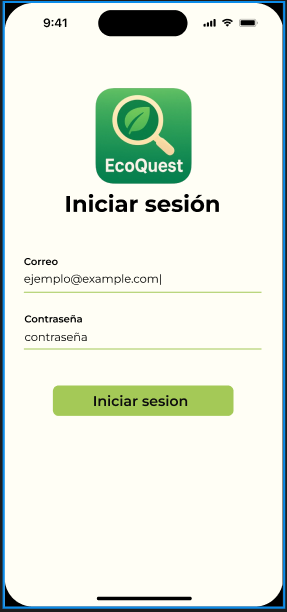
<div class="caption">Inicio de sesión con correo y contraseña</div>

</div>
<div class="center">

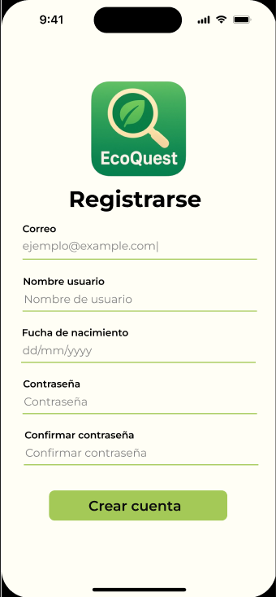
<div class="caption">Registro con validación de campos</div>

</div>
</div>

---

# 🏠 Pantalla principal y navegación

<div class="cols2">
<div class="center">

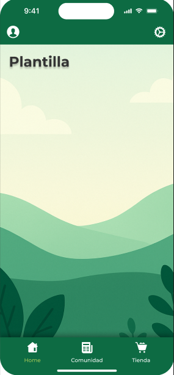
<div class="caption">Home con navegación inferior: Home · Comunidad · Tienda</div>

</div>
<div>

## Estructura de navegación

- Barra inferior fija con 3 destinos principales
- Icono de perfil en la esquina superior izquierda
- Icono de ajustes en la esquina superior derecha
- Fondo generativo con paisaje animado en Compose Canvas

<div class="card" style="margin-top: 16px">
  🎨 <strong>Canvas personalizado</strong><br/>
  El paisaje de colinas se dibuja con <code>DrawScope</code> y trazados cúbicos (<code>cubicTo</code>) — sin imágenes, solo código.
</div>

</div>
</div>

---

# 🤝 Comunidades

<div class="cols2">
<div class="center">

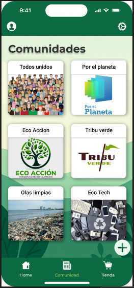
<div class="caption">Lista de comunidades disponibles</div>

</div>
<div class="center">

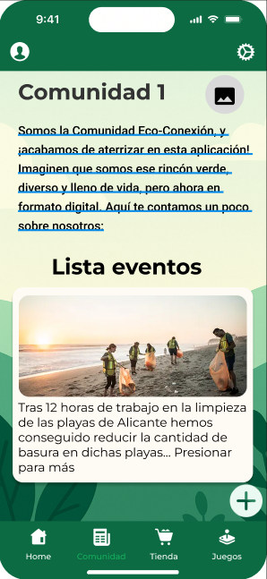
<div class="caption">Detalle de comunidad con lista de eventos</div>

</div>
</div>

---

# 🤝 Crear y editar comunidad

<div class="cols2">
<div class="center">

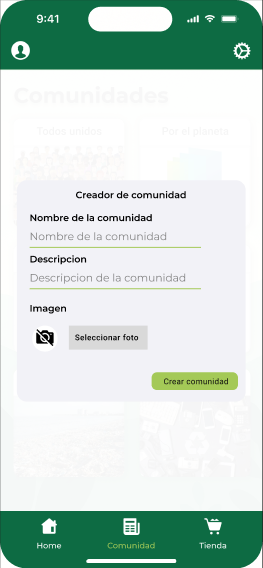
<div class="caption">Diálogo: crear nueva comunidad</div>

</div>
<div class="center">

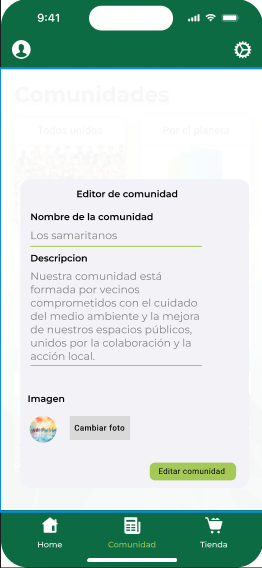
<div class="caption">Diálogo: editar comunidad existente</div>

</div>
</div>

---

# 📅 Eventos

<div class="cols2">
<div class="center">

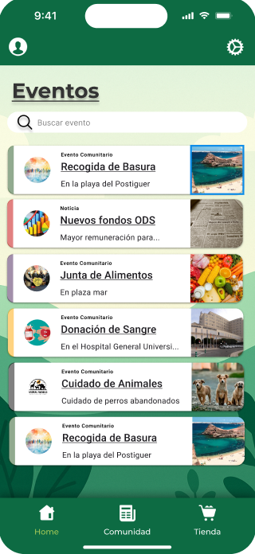
<div class="caption">Feed de eventos con búsqueda en tiempo real</div>

</div>
<div class="center">

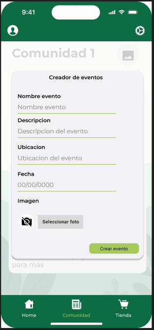
<div class="caption">Formulario de creación de evento</div>

</div>
</div>

---

# 📅 Editar eventos

<div class="cols2">
<div class="center">

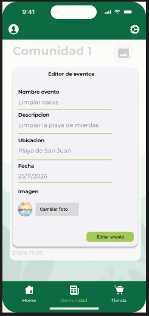
<div class="caption">Editor de evento con datos precargados</div>

</div>
<div>

## Tipos de evento

<div class="card">📢 <strong>Evento Comunitario</strong><br/>Actividades organizadas por la comunidad</div>
<div class="card">📰 <strong>Noticia</strong><br/>Información relevante para los miembros</div>
<div class="card">🚨 <strong>Urgente</strong><br/>Acciones que requieren respuesta inmediata</div>

</div>
</div>

---

# 🏪 Tienda de Puntos

<div class="cols2">
<div class="center">

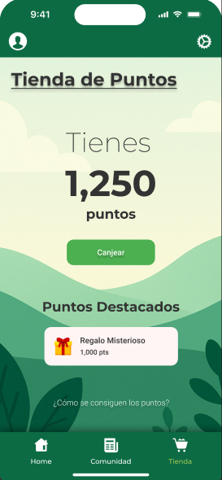
<div class="caption">Puntos disponibles y producto destacado</div>

</div>
<div class="center">

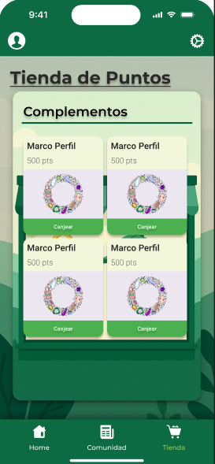
<div class="caption">Catálogo de complementos canjeables</div>

</div>
</div>

---

# 👤 Perfil de usuario

<div class="cols2">
<div class="center">

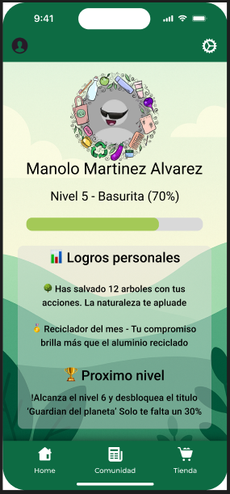
<div class="caption">Perfil con nivel, logros y progreso al siguiente nivel</div>

</div>
<div>

## Gamificación del perfil

- Sistema de niveles (ej. Nivel 5 - Basurita)
- Barra de progreso hacia el siguiente nivel
- Logros personales por acciones ecológicas
- Título desbloqueado al subir de nivel

<div class="card" style="margin-top:16px">
  🏆 <strong>Ejemplo de logro</strong><br/>
  "Has salvado 12 árboles con tus acciones. La naturaleza te aplaude."
</div>

</div>
</div>

---

<!-- _class: divider -->

# 🖥️ Panel de Administración

### WPF · C# · .NET · MVVM

---

# 🖥️ Gestión de usuarios

<div class="cols2">
<div class="center">

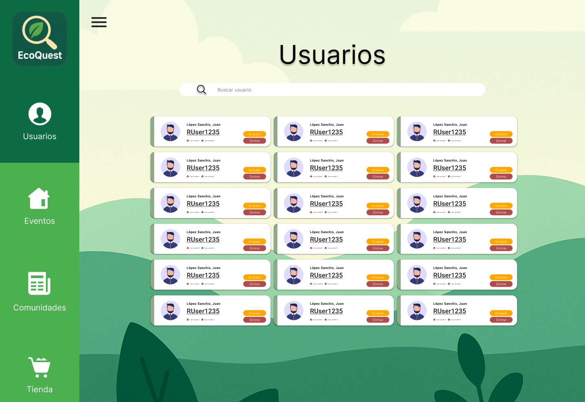
<div class="caption">Lista de todos los usuarios registrados</div>

</div>
<div class="center">

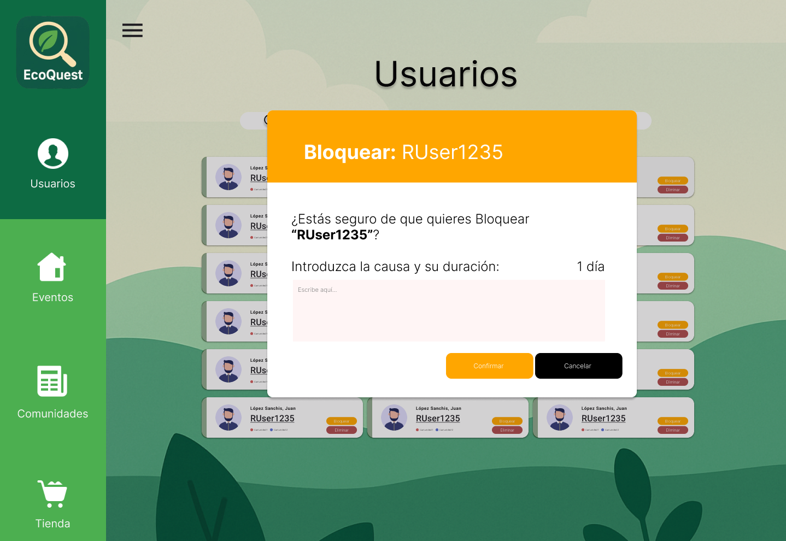
<div class="caption">Diálogo de bloqueo con causa y duración</div>

</div>
</div>

---

# 🖥️ Gestión de comunidades

<div class="cols2">
<div class="center">

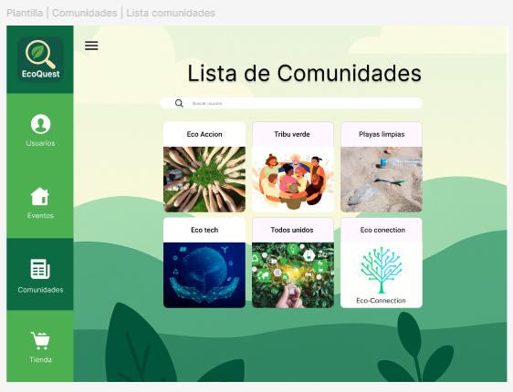
<div class="caption">Lista de comunidades activas</div>

</div>
<div class="center">

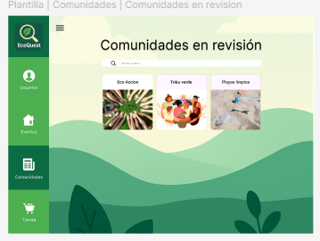
<div class="caption">Comunidades pendientes de aprobación</div>

</div>
</div>

<div class="center" style="margin-top:10px">

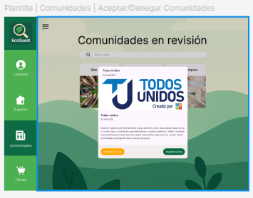
<div class="caption">Vista detalle para aceptar o denegar una comunidad</div>

</div>

---

# 🖥️ Gestión de eventos

<div class="cols2">
<div class="center">

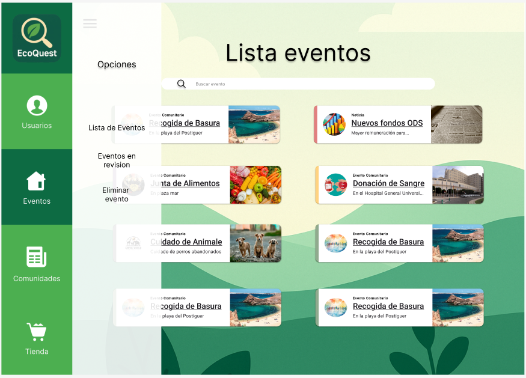
<div class="caption">Lista de todos los eventos</div>

</div>
<div class="center">

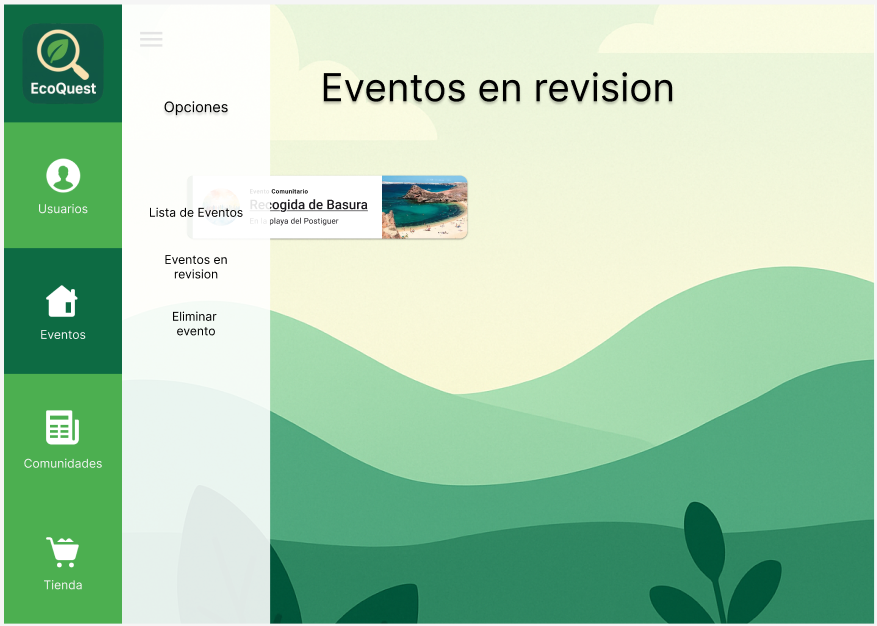
<div class="caption">Eventos pendientes de revisión</div>

</div>
</div>

<div class="center" style="margin-top:10px">

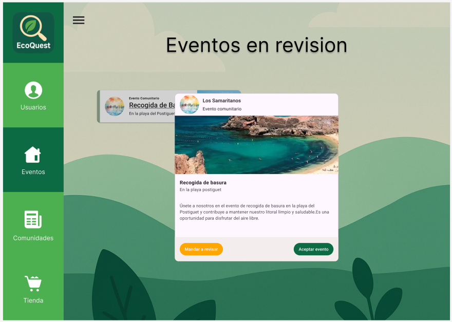
<div class="caption">Detalle del evento para aprobar o rechazar</div>

</div>

---

# 🖥️ Gestión de accesorios (Tienda)

<div class="cols3">
<div class="center">

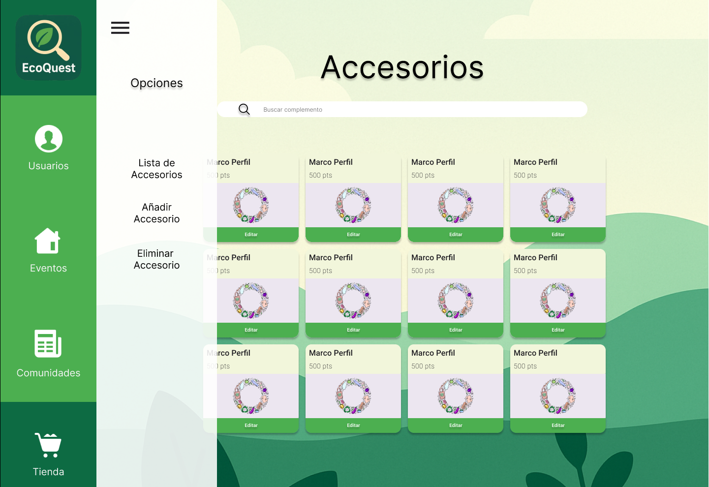
<div class="caption">Catálogo de accesorios</div>

</div>
<div class="center">

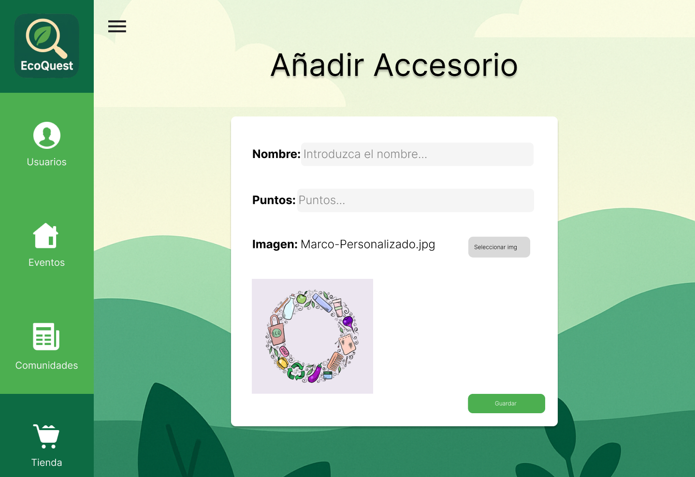
<div class="caption">Añadir accesorio nuevo</div>

</div>
<div class="center">

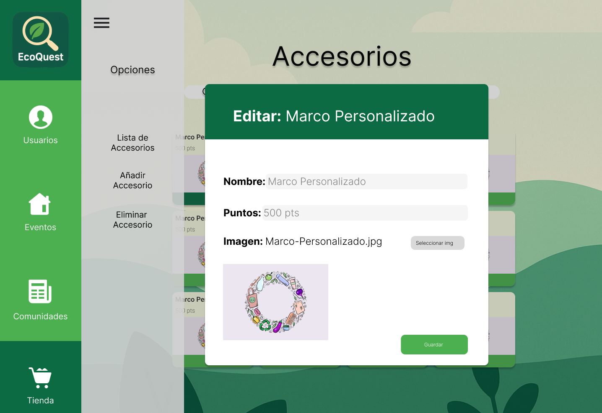
<div class="caption">Editar accesorio existente</div>

</div>
</div>

---

# 🔧 Características técnicas destacables

<div class="cols2">
<div>

## Estado reactivo — Flow + Compose

```kotlin
// ViewModel: un único estado observable
var state by mutableStateOf(EventosUiState())
    private set

init {
    viewModelScope.launch {
        // Flow de Room: la UI se actualiza sola
        // cuando cambia la base de datos
        repo.getAll().collect { lista ->
            state = state.copy(eventos = lista)
        }
    }
}
```

## Inyección de dependencias — Hilt

```kotlin
@HiltViewModel
class EventosViewModel @Inject constructor(
    private val repo: EventoRepository
) : ViewModel()
```

</div>
<div>

## Autenticación JWT — Retrofit interceptor

```kotlin
class AuthInterceptor(private val token: String)
    : Interceptor {
    override fun intercept(chain: Chain) =
        chain.proceed(
            chain.request().newBuilder()
                .header("Authorization", "Bearer $token")
                .build()
        )
}
```

## Room — datos offline + seed idempotente

```kotlin
// IGNORE: no sobreescribe si ya existe
@Insert(onConflict = OnConflictStrategy.IGNORE)
suspend fun insertAllIfAbsent(
    eventos: List<EventoEntity>
)
```

</div>
</div>

---

# 🏁 Conclusión

<div class="cols2">
<div>

## Lo que hemos construido

- 📱 App Android con 10+ pantallas funcionales
- ☁️ API REST con autenticación JWT
- 🖥️ Panel WPF con gestión completa
- 🔗 Las 3 plataformas conectadas en tiempo real

## Posibles ampliaciones

- 📍 Geolocalización de eventos en mapa
- 🤖 Retos personalizados con IA
- 🔔 Notificaciones push
- 🌐 Versión web responsive

</div>
<div>

## El equipo — Equipo Prompt

<div class="card">
  ✅ <strong>Puntos fuertes</strong><br/>
  Reparto claro por plataforma. Buen uso de Git para integrar el trabajo de todo el equipo.
</div>
<div class="card">
  ⚡ <strong>Mayor reto</strong><br/>
  Coordinar 3 plataformas distintas sobre una sola API requirió definir bien los contratos desde el principio.
</div>
<div class="card">
  📚 <strong>Mayor aprendizaje</strong><br/>
  Jetpack Compose y MVVM en un proyecto real de tamaño considerable. También la integración completa backend ↔ móvil ↔ escritorio.
</div>

</div>
</div>

---

<!-- _class: cover -->

# 🌿 ¡Gracias!

<div class="sub">Esta ha sido nuestra propuesta — EcoQuest</div>

<div class="meta">
  👥 <strong>Equipo Prompt</strong> &nbsp;·&nbsp; IES Doctor Balmis · DAM 2025–2026<br/><br/>
  🔗 github.com/Prompt-pi2damiesbalmis/PROYECTOI2
</div>
