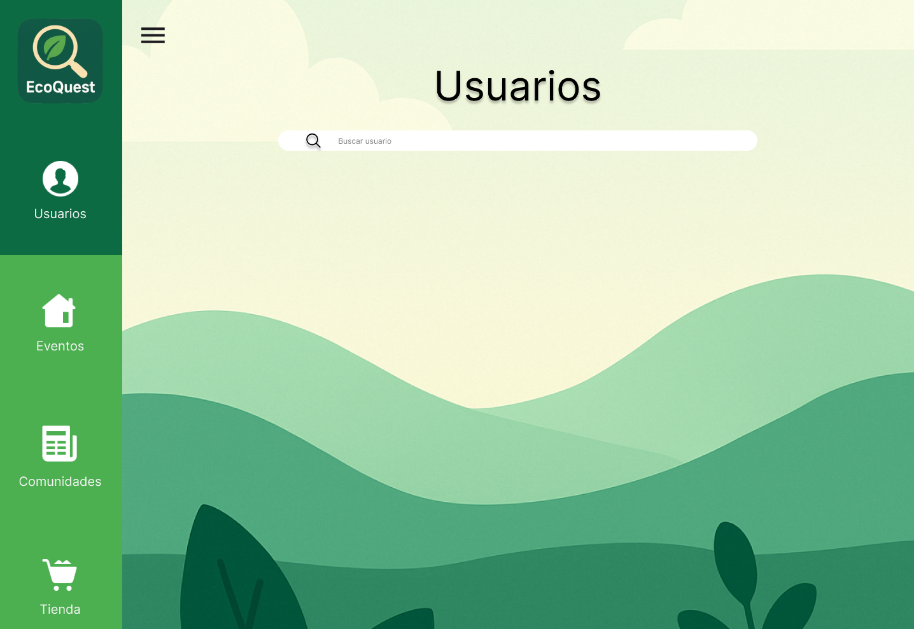

<!-- _class: cover -->

# 🌿 EcoQuest

<div class="subtitle">Plataforma de concienciación ambiental gamificada</div>

<div class="meta">
  👥 <strong>Equipo Prompt</strong> &nbsp;·&nbsp; IES Doctor Balmis &nbsp;·&nbsp; DAM 2025–2026<br/>
  📱 App Android &nbsp;·&nbsp; ☁️ API REST &nbsp;·&nbsp; 🖥️ Panel de Administración WPF
</div>

---

# 💡 Introducción

<div class="cols2">
<div>

## ¿Por qué EcoQuest?

- 🌍 La gente quiere actuar, pero no sabe cómo
- 🏘️ Falta de canales para organizarse localmente
- 🎮 Las apps verdes existentes no enganchan

## Nuestra propuesta

- Comunidades vecinales conectadas
- Eventos y retos ecológicos reales
- Sistema de puntos que motiva la participación

</div>
<div>

<div class="card">
  <strong>🎯 Objetivo</strong><br/>
  Fomentar hábitos sostenibles mediante comunidades locales, eventos reales y recompensas.
</div>

<div class="card">
  <strong>👥 Usuarios</strong><br/>
  <span class="tag">Ciudadano</span> usa la app móvil<br/>
  <span class="tag-gray">Administrador</span> gestiona desde el panel WPF
</div>

<div class="card">
  <strong>🔗 Conectado</strong><br/>
  Móvil y escritorio comparten datos en tiempo real a través de la API REST.
</div>

</div>
</div>

---

# 🏛️ Arquitectura del sistema

<div class="cols2">
<div>

<div class="arch-box"><strong>📱 App Android</strong><small>Kotlin · Jetpack Compose · Hilt · Room · Retrofit</small></div>
<div class="arch-arrow">⬆️⬇️  REST / JWT</div>
<div class="arch-box" style="border-color:#1565C0"><strong>☁️ API REST</strong><small>Spring Boot 3.4 · Java 21 · Puerto 9000</small></div>
<div class="arch-arrow">⬆️⬇️  JPA / Hibernate</div>
<div class="arch-box" style="border-color:#6A1B9A"><strong>🗄️ Base de datos</strong><small>PostgreSQL (prod) · H2 (dev)</small></div>
<div class="arch-arrow">⬆️⬇️  REST / JWT</div>
<div class="arch-box" style="border-color:#E65100"><strong>🖥️ Panel Admin WPF</strong><small>C# · .NET · MVVM</small></div>

</div>
<div>

## Android — patrón MVVM

```
Compose UI
   ↕ eventos / estado
ViewModel  ←  Hilt DI
   ↕
Repository
   ↕         ↕
Room DB    Retrofit
(offline)  (API REST)
```

- Cada pantalla: `Screen` + `ViewModel` + `UiState` + `Event`
- Estado reactivo con `Flow` y `mutableStateOf`
- Navegación type-safe con `@Serializable`

</div>
</div>

---

# ✨ Funcionalidades — App Android

<div class="cols2" style="align-items:center">
<div style="text-align:center">


</div>
<div>

## Comunidades

- Explorar y unirse a comunidades locales
- Mural compartido por comunidad
- El administrador aprueba comunidades nuevas

## Eventos comunitarios

- Feed filtrable en tiempo real
- Tipos: Comunitario · Noticia · Urgente
- Cualquier miembro puede crear eventos

</div>
</div>

---

# ✨ Funcionalidades — App Android

<div class="cols2" style="align-items:center">
<div style="text-align:center">


</div>
<div>

## Tienda de Puntos

- Los usuarios acumulan puntos participando
- Catálogo de recompensas canjeables
- Vista de puntos disponibles en tiempo real

## Perfil de usuario

- Datos personales editables
- Historial de actividad
- Foto de perfil

</div>
</div>

---

<!-- _class: divider -->

# 🖥️ App de Escritorio

### Panel de administración — WPF · C# · MVVM

---

# 🖥️ Panel de Administración

<div class="cols2" style="align-items:center">
<div style="text-align:center">



</div>
<div>

## Destinada al administrador

- Gestión completa de usuarios
- Aprobar o rechazar comunidades
- Moderar eventos publicados
- Gestionar complementos de la tienda

<div class="card" style="margin-top:16px">
  🔗 <strong>Lo que hace el admin se refleja en tiempo real en la app móvil</strong> — comparten la misma API REST y base de datos.
</div>

</div>
</div>

---

# 🖥️ Panel — Gestión de comunidades

<div class="cols2" style="align-items:center">
<div style="text-align:center">


</div>
<div style="text-align:center">


</div>
</div>

<p style="text-align:center; font-size:0.8em; color:#555; margin-top:8px">
  Lista de comunidades &nbsp;·&nbsp; Flujo de aprobación de comunidades pendientes
</p>

---

# 🔧 Características técnicas destacables

<div class="cols2">
<div>

## Jetpack Compose + MVVM

```kotlin
@HiltViewModel
class EventosViewModel @Inject constructor(
    private val repo: EventoRepository
) : ViewModel() {

    var state by mutableStateOf(EventosUiState())
        private set

    init {
        viewModelScope.launch {
            repo.getAll().collect { lista ->
                state = state.copy(eventos = lista)
            }
        }
    }
}
```

Estado reactivo: cuando cambia la BD, la UI se actualiza sola.

</div>
<div>

## Autenticación JWT

```kotlin
// Retrofit interceptor añade el token
// automáticamente en cada petición
class AuthInterceptor(private val token: String)
    : Interceptor {
    override fun intercept(chain: Chain) =
        chain.proceed(
            chain.request().newBuilder()
                .header("Authorization", "Bearer $token")
                .build()
        )
}
```

## Hilt — Inyección de dependencias

<span class="tag">@HiltViewModel</span>
<span class="tag">@Singleton</span>
<span class="tag">@Inject constructor</span>

Sin instanciar manualmente ningún repositorio ni DAO.

</div>
</div>

---

# 🔧 Características técnicas destacables

<div class="cols2">
<div>

## Room — persistencia local

```kotlin
@Dao
interface EventoDao {
    @Query("SELECT * FROM eventos")
    fun getAll(): Flow<List<EventoEntity>>

    // IGNORE = idempotente: no sobreescribe
    // datos existentes en reinicios
    @Insert(onConflict = OnConflictStrategy.IGNORE)
    suspend fun insertAllIfAbsent(
        eventos: List<EventoEntity>
    )
}
```

La app funciona **offline** gracias a Room. Retrofit sincroniza cuando hay conexión.

</div>
<div>

## Stack completo

<div class="card"><span class="tag">Kotlin</span> <span class="tag">Jetpack Compose</span> <span class="tag">Hilt</span> <span class="tag">Room</span> <span class="tag">Retrofit</span> <span class="tag">Coil</span><br/><small style="color:#555">App Android</small></div>

<div class="card"><span class="tag-gray">Spring Boot 3.4</span> <span class="tag-gray">Java 21</span> <span class="tag-gray">JWT</span> <span class="tag-gray">JPA</span> <span class="tag-gray">PostgreSQL</span><br/><small style="color:#555">API REST</small></div>

<div class="card"><span class="tag" style="background:#E65100">C#</span> <span class="tag" style="background:#E65100">WPF</span> <span class="tag" style="background:#E65100">.NET</span> <span class="tag" style="background:#E65100">MVVM</span><br/><small style="color:#555">Panel administrador</small></div>

</div>
</div>

---

# 🏁 Conclusión

<div class="cols2">
<div>

## Lo que hemos entregado

- 📱 App Android funcional (6 pantallas)
- ☁️ API REST con auth JWT
- 🖥️ Panel de administración WPF
- 🔗 Las 3 plataformas conectadas

## Posibles ampliaciones

- 📍 Geolocalización de eventos
- 🤖 Retos personalizados con IA
- 🔔 Notificaciones push
- 🌐 Versión web responsive

</div>
<div>

## El equipo — Equipo Prompt

<div class="card">
  ✅ <strong>Pros</strong><br/>
  Reparto claro de tareas por plataforma. Buen uso de Git para integrar el trabajo.
</div>
<div class="card">
  ⚡ <strong>Retos</strong><br/>
  Coordinar 3 plataformas distintas con una sola API compartida requirió definir bien los contratos desde el principio.
</div>
<div class="card">
  📚 <strong>Aprendizaje principal</strong><br/>
  Jetpack Compose y MVVM en un proyecto real de tamaño considerable.
</div>

</div>
</div>

---

<!-- _class: cover -->

# 🌿 ¡Gracias!

<div class="subtitle">Esta ha sido nuestra propuesta — EcoQuest</div>

<div class="meta">
  👥 <strong>Equipo Prompt</strong> &nbsp;·&nbsp; IES Doctor Balmis · DAM 2025–2026<br/><br/>
  🔗 github.com/Prompt-pi2damiesbalmis/PROYECTOI2
</div>
