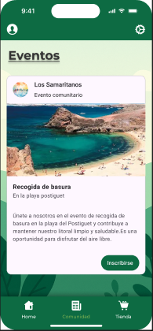

<!-- _class: cover -->

# 🌿 EcoQuest

## Plataforma de concienciación ambiental gamificada

<p>
  👥 <strong>Equipo Prompt</strong> &nbsp;|&nbsp; IES Doctor Balmis &nbsp;|&nbsp; DAM 2025–2026<br/>
  📱 Android &nbsp;·&nbsp; ☁️ Spring Boot API &nbsp;·&nbsp; 🖥️ Panel WPF<br/>
  📅 Mayo 2026
</p>

---

# 🎯 ¿Qué es EcoQuest?

<div class="columns">
<div>

### El problema
- 🌍 La gente quiere actuar pero no sabe cómo
- 📣 Falta de comunidades locales activas
- 🎮 Las apps verdes son aburridas

### Nuestra solución
- 🏆 Gamificación de acciones ecológicas
- 🤝 Comunidades vecinales conectadas
- 📰 Eventos e información en tiempo real

</div>
<div>

<div class="card">
  <h3>🎯 Objetivo</h3>
  Fomentar hábitos sostenibles mediante recompensas, comunidades y retos ecológicos accesibles para todos.
</div>

<div class="card">
  <h3>👤 Usuario objetivo</h3>
  Ciudadanos 16–45 años comprometidos con el medio ambiente y su entorno local.
</div>

</div>
</div>

---

# 🛠️ Stack tecnológico

<div class="columns-3">
<div>

### 📱 Android
<span class="tag">Kotlin</span>
<span class="tag">Jetpack Compose</span>
<span class="tag">Hilt</span>
<span class="tag">Room</span>
<span class="tag">Retrofit</span>
<span class="tag">Coil</span>

</div>
<div>

### ☁️ Backend
<span class="tag">Spring Boot 3.4</span>
<span class="tag">Java 21</span>
<span class="tag">JWT</span>
<span class="tag">PostgreSQL</span>
<span class="tag">H2 (dev)</span>
<span class="tag">REST API</span>

</div>
<div>

### 🖥️ Admin Panel
<span class="tag">WPF</span>
<span class="tag">C#</span>
<span class="tag">.NET</span>
<span class="tag">MVVM</span>

### 🔧 Herramientas
<span class="tag">GitHub</span>
<span class="tag">Android Studio</span>

</div>
</div>

---

# 🏛️ Arquitectura

<div class="columns">
<div>

### Patrón MVVM

```
UI (Compose)
    ↕  eventos / estado
ViewModel (Hilt)
    ↕  repositorios
Repository
    ↕ ↕
  Room  Retrofit
(local) (remoto)
```

- ✅ Separación de responsabilidades
- ✅ Estado reactivo con `Flow`
- ✅ Inyección de dependencias (Hilt)
- ✅ Navegación type-safe (`@Serializable`)

</div>
<div>

### Capas del sistema

<div class="card">
  📱 <strong>App Android</strong><br/>MVVM · Compose · Room · Retrofit
</div>
<div class="card">
  ☁️ <strong>API REST</strong> (puerto 9000)<br/>Spring Boot · JWT · PostgreSQL
</div>
<div class="card">
  🖥️ <strong>Panel Administrador</strong><br/>WPF · C# · MVVM
</div>

</div>
</div>

---

# ✨ Funcionalidades principales

<div class="columns">
<div>

### 🔐 Autenticación
- Registro e inicio de sesión
- JWT seguro con refresh
- Perfil de usuario editable

### 🤝 Comunidades
- Explorar comunidades locales
- Unirse y participar
- Mural compartido por comunidad

</div>
<div>

### 📅 Eventos
- Feed de eventos comunitarios
- Filtrado por nombre en tiempo real
- Tipos: Comunitario · Noticia · Urgente

### 🏪 Tienda de Puntos
- Catálogo de recompensas
- Canjear puntos ganados
- Historial de actividad ecológica

</div>
</div>

---

<!-- _class: divider -->

# 📱 Demo
### Pantallas de la aplicación

---

# 🔐 Acceso y Perfil

<div class="columns">
<div style="text-align:center">


**Inicio de sesión**

</div>
<div style="text-align:center">


**Perfil de usuario**

</div>
</div>

---

# 🤝 Comunidades

<div class="columns">
<div style="text-align:center">


**Explorar comunidades**

</div>
<div style="text-align:center">


**Vista de comunidad**

</div>
</div>

---

# 📅 Eventos y Crear Evento

<div class="columns">
<div style="text-align:center">


**Feed de eventos**

</div>
<div style="text-align:center">


**Crear nuevo evento**

</div>
</div>

---

# 🏪 Tienda de Puntos

<div class="columns">
<div style="text-align:center">


**Canjear recompensas**

</div>
<div>

<div class="card">
  🏆 <strong>Sistema de puntos</strong><br/>
  Los usuarios acumulan puntos participando en eventos y retos ecológicos
</div>
<div class="card">
  🎁 <strong>Recompensas</strong><br/>
  Productos, descuentos y experiencias canjeables en la tienda
</div>
<div class="card">
  📊 <strong>Motivación</strong><br/>
  La gamificación incrementa la participación activa en la comunidad
</div>

</div>
</div>

---

# 🏁 Conclusiones

<div class="columns">
<div>

### ✅ Logros del proyecto
- Arquitectura MVVM sólida y escalable
- App Android funcional con 6 pantallas
- API REST con autenticación JWT
- Panel de administración WPF
- Integración Room + Retrofit

### 📚 Aprendizajes
- Jetpack Compose en producción
- Diseño orientado a capas
- Trabajo en equipo con Git

</div>
<div>

### 🚀 Próximos pasos

<div class="card">📍 Geolocalización de eventos</div>
<div class="card">🤖 IA para sugerir retos personalizados</div>
<div class="card">🌐 Versión web (React / Angular)</div>
<div class="card">📊 Dashboard de impacto ambiental</div>
<div class="card">🔔 Notificaciones push</div>

</div>
</div>

---

<!-- _class: cover -->

# 🌿 ¡Gracias!

## EcoQuest — Juntos por un planeta mejor

<p>
  👥 <strong>Equipo Prompt</strong><br/>
  🏫 IES Doctor Balmis · DAM 2025–2026<br/><br/>
  📧 Contacto: michelgg08@gmail.com<br/>
  🔗 GitHub: github.com/Prompt-pi2damiesbalmis/PROYECTOI2
</p>
